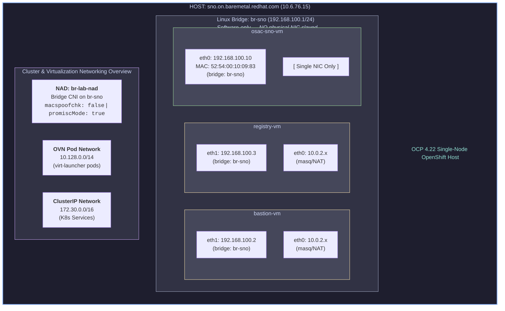
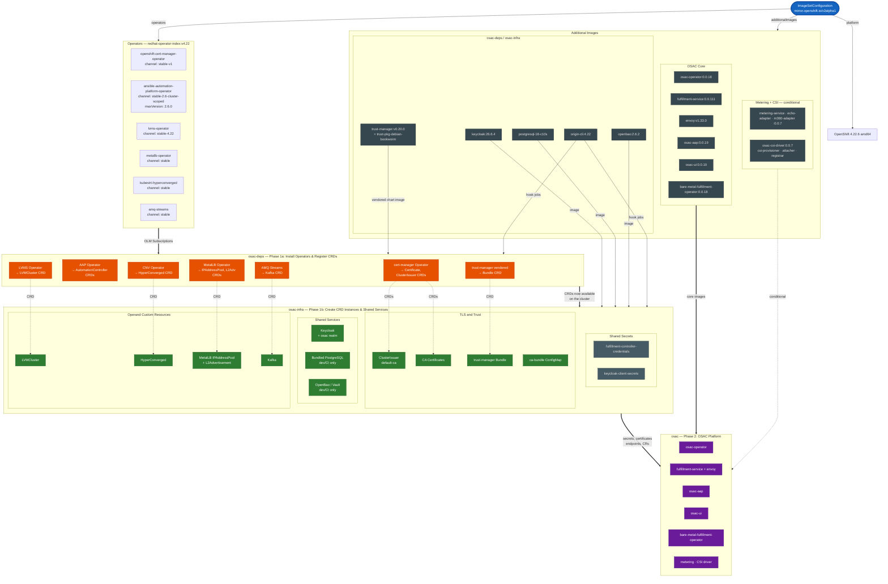
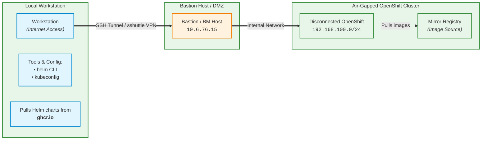

# Disconnected Installation Guide

This guide covers installing OSAC on OpenShift clusters that operate in
disconnected (air-gapped) or restricted-network environments where direct
access to the default Red Hat operator catalogs is unavailable.

## Overview

OSAC depends on several operators delivered through the Operator Lifecycle
Manager (OLM). In a connected environment the `osac-deps` Helm chart installs OLM `Subscription` resources. These OLM `Subscription` resources reference the default
`redhat-operators` CatalogSource in the `openshift-marketplace` namespace.

### Before you start

You must be aware about the [Disconnected Environment Terms](https://docs.redhat.com/en/documentation/openshift_container_platform/4.22/html/disconnected_environments/about-disconnected-environments).

This document is validated against a restricted environment.

OSAC installation is configurable to provide core components in conjunction with
rest of the services like VMaaS,BMaaS,CaaS etc. Depending upon your choice of
services, toggling and customization of Helm values must be done.

For Ansible Automation Platform, obtain a subscription manifest in the
Subscription Allocations section of Red Hat Subscription Management.  This
document will refer to it by license.zip file.

Even for a disconnected OpenShift installation, you must obtain and use
a pull secret from Red Hat Cloud along with the pull secret to pull from the
openshift mirror registry.

#### Example networking setup



In a disconnected environment , these mandatory checks must pass

1. Successfully mirror all the container images.
2. CRIO daemon and kubelet on the osac vm must be able to resolve the openshift mirror registry.

## Required Operator Packages

The following operator packages must be available in the mirrored catalog:

| Operator | Package Name | Default Channel |
| ---------- | ------------- | ----------------- |
| Ansible Automation Platform | `ansible-automation-platform-operator` | `stable-2.6-cluster-scoped` |
| AMQ Streams (Kafka) | `amq-streams` | `stable` |
| cert-manager | `openshift-cert-manager-operator` | `stable-v1` |
| OpenShift Virtualization (CNV) | `kubevirt-hyperconverged` | `stable` |
| LVM Storage | `lvms-operator` | `stable-4.22` |
| Multicluster Engine | `multicluster-engine` | `stable-2.17` |
| MetalLB | `metallb-operator` | `stable` |

> **Note:** Not every operator is required for every deployment. Only the
> operators enabled in your `values.yaml` need to be present in the
> mirrored catalog.

## Mirroring with oc-mirror

Use `oc-mirror` to build a mirror of the required Openshift catalogs,
Red Hat container images & non Red Hat Container images as well as
OSAC container images . Below is a working  `ImageSetConfiguration` tested in a
disconnected environment.
>**Note**:At the time of testing, at the least 400GiB storage space is required
>for this mirrored registry.

```yaml
apiVersion: mirror.openshift.io/v2alpha1
kind: ImageSetConfiguration
archiveSize: 8
mirror:
  platform:
    architectures:
      - amd64
    channels:
      - name: stable-4.22
        minVersion: 4.22.6
        maxVersion: 4.22.6
  operators:
    - catalog: registry.redhat.io/redhat/redhat-operator-index:v4.22
      packages:
        - name: ansible-automation-platform-operator
          defaultChannel: stable-2.6-cluster-scoped
          channels:
            - name: stable-2.6-cluster-scoped
              maxVersion: '2.6.0+0.1787258256' # osac-installer/docs/cve-2026-75884-security-exception.md
        - name: openshift-cert-manager-operator
          channels:
            - name: stable-v1
        - name: amq-streams
          channels:
            - name: stable
        # VMaaS services
        - name: kubevirt-hyperconverged
          channels:
            - name: stable
        - name: lvms-operator
          channels:
            - name: stable-4.22
        - name: metallb-operator
          channels:
            - name: stable
        - name: multicluster-engine
          channels:
            - name: stable-2.17
  additionalImages:
    # --- osac-deps and osac-infra. ---
    - name: ghcr.io/openbao/openbao:2.6.2 # Bundled OpenBao (Vault-compatible) secret store for dev/CI environments.
    - name: quay.io/jetstack/trust-manager:v0.20.0 # Helm chart osac-deps trust-manager
    - name: quay.io/jetstack/trust-pkg-debian-bookworm:20230311-deb12u1.1 # Helm chart osac-deps trust-manager
    - name: quay.io/keycloak/keycloak:26.6.4 # Helm chart osac-deps keycloak
    - name: quay.io/openshift/origin-cli:4.22 # Consumed by OSAC dependencies
    - name: quay.io/sclorg/postgresql-18-c10s@sha256:6be2c9d855f06fb665257a6b0911676a38d740be7022cc61acee1c99a832b1b2 # Helm osac-deps bundled-postgres
    # --- OSAC core components ---
    - name: ghcr.io/osac-project/osac-operator:0.0.18
    - name: ghcr.io/osac-project/fulfillment-service:0.0.111
    - name: ghcr.io/osac-project/envoy:v1.33.0
    - name: ghcr.io/osac-project/osac-aap:0.0.19
    - name: ghcr.io/osac-project/osac-ui:0.0.10
    - name: ghcr.io/osac-project/bare-metal-fulfillment-operator:0.0.18
    # --- OSAC metering (conditional: metering.enabled) ---
    - name: ghcr.io/osac-project/metering-service:0.0.7
    - name: ghcr.io/osac-project/metering-echo-adapter:0.0.7
    - name: ghcr.io/osac-project/metering-m360-adapter:0.0.7
    # --- OSAC CSI driver (conditional: csiDriver.enabled) ---
    - name: ghcr.io/osac-project/osac-csi-driver:0.0.7
    # --- CSI sidecars (used by csi-driver controller and node daemonset) ---
    - name: registry.k8s.io/sig-storage/csi-provisioner:v5.1.0
    - name: registry.k8s.io/sig-storage/csi-attacher:v4.7.0
    - name: registry.k8s.io/sig-storage/csi-node-driver-registrar:v2.12.0

```

Mirror the images.

```bash
oc-mirror --v2 --config=imageset-config.yaml --workspace \
file://$(pwd)/oc-mirror-workspace docker://registry.example.com:8443/
```

>**Tip**: In dev setup, using `-dest-tls-verify=false   --parallel-images 1   --parallel-layers 1`
> avoids TLS certification and registry db lockup issues.

Expected Result:

```bash
....
481 / 481 (1h7m41s) [====================================================] 100 %
2026/10/01 01:53:58  [INFO]   : === Results ===
2026/10/01 01:53:58  [INFO]   :  ✓  192 / 192 release images mirrored successfully
2026/10/01 01:53:58  [INFO]   :  ✓  266 / 266 operator images mirrored successfully
2026/10/01 01:53:58  [INFO]   :  ✓  23 / 23 additional images mirrored:
2026/10/01 01:53:58  [INFO]   : Generating pinned configurations
2026/10/01 01:53:58  [INFO]   : Pinned ISC written to: $(pwd)/oc-mirror-workspace/working-dir/isc_pinned_2026-10-01T05:53:58Z.yaml
2026/10/01 01:53:58  [INFO]   : Pinned DISC written to: $(pwd)/oc-mirror-workspace/working-dir/disc_pinned_2026-10-01T05:53:58Z.yaml
2026/10/01 01:53:58  [INFO]   : Generating cluster resources
2026/10/01 01:53:58  [INFO]   : Generating IDMS file
2026/10/01 01:53:58  [INFO]   : $(pwd)/oc-mirror-workspace/working-dir/cluster-resources/idms-oc-mirror.yaml file created
2026/10/01 01:53:58  [INFO]   : Generating ITMS file
2026/10/01 01:53:58  [INFO]   : $(pwd)/oc-mirror-workspace/working-dir/cluster-resources/itms-oc-mirror.yaml file created
2026/10/01 01:53:58  [INFO]   : Pinned DISC written to: $(pwd)/oc-mirror-workspace/working-dir/disc_pinned_2026-10-01T05:53:58Z.yaml
2026/10/01 01:53:58  [INFO]   : 📄 Generating cluster resources...
2026/10/01 01:53:58  [INFO]   : 📄 Generating IDMS file...
2026/10/01 01:53:58  [INFO]   : $(pwd)/oc-mirror-workspace/working-dir/cluster-resources/idms-oc-mirror.yaml file created
2026/10/01 01:53:58  [INFO]   : 📄 Generating ITMS file...
2026/10/01 01:53:58  [INFO]   : $(pwd)/oc-mirror-workspace/working-dir/cluster-resources/itms-oc-mirror.yaml file created
2026/10/01 01:53:58  [INFO]   : 📄 Generating CatalogSource file...
2026/10/01 01:53:58  [INFO]   : $(pwd)/oc-mirror-workspace/working-dir/cluster-resources/cs-redhat-operator-index-v4-22.yaml file created
2026/10/01 01:53:58  [INFO]   : 📄 Generating ClusterCatalog file...
2026/10/01 01:53:58  [INFO]   : $(pwd)/oc-mirror-workspace/working-dir/cluster-resources/cc-redhat-operator-index-v4-22.yaml file created
2026/10/01 01:53:58  [INFO]   : 📄 Generating Signature Configmap...
2026/10/01 01:53:58  [INFO]   : $(pwd)/oc-mirror-workspace/working-dir/cluster-resources/signature-configmap.json file created
2026/10/01 01:53:58  [INFO]   : $(pwd)/oc-mirror-workspace/working-dir/cluster-resources/signature-configmap.yaml file created
2026/10/01 01:53:58  [INFO]   : mirror time     : 1h8m8.261079897s
2026/10/01 01:53:58  [INFO]   : 👋 Goodbye, thank you for using oc-mirror

```

As a OSAC CSA, you must be **authorized** to apply the generated IDMS
`ImageDigestMirrorSet` file, ITMS(`ImageTagMirrorSet`) file, `CatalogSource` file,
`ClusterCatalog` file and Signature Configmap.

Dependency relationship between ImageSetConfiguration, OSAC Deps,OSAC Infra & OSAC.
Assuming OSAC v0.0.21.



### Helm Charts

The helm charts osac-infra & osac-deps helm chart are helper charts.
The `osac` helm chart must be pinned to specific release tag( for eg, 0.0.21 )
> [!IMPORTANT]
> Existing version of oc-mirror does not support mirroring of the
> osac helm chart for 2 reasons . 1. No support for `oci:` protocol[^1]
> 2. No support for passing values to the helm chart [^2]

#### Installing OSAC on a Disconnected Cluster via a Bastion Laptop

In disconnected environments where cluster nodes cannot reach external
registries, OSAC can be installed using an internet-connected workstation
(laptop) as a bridge. The workstation pulls Helm charts from the upstream
registry and submits rendered manifests to the cluster API server through
an SSH tunnel — no Helm chart mirroring is required.



#### Disconnected Installation specific values

The customer guide and the helm deployment guide in this repository provides
helm commands  to discover the helm values. This document will provide information on
distinct Helm values making disconnected installation smoother.
In both the connected and disconnected environments, the following shell variables
are essential. At the time of writing, `DOMAIN`, `OCP_VERSION` and `KC_HOSTNAME`
must exist.

#### Overriding

The `osac-deps` chart exposes two values that control which CatalogSource
every operator Subscription references:

| Value | Default | Description |
| ------- | --------- | ------------- |
| `catalogSource` | `redhat-operators` | Name of the OLM `CatalogSource` CR |
| `catalogSourceNamespace` | `openshift-marketplace` | Namespace where the CatalogSource exists |
| `cliImage` | `quay.io/openshift/origin-cli:4.20.0` | Name of the Openshift CLI used by OSAC installation specific hooks |

##### Helm install / upgrade command line based parameters

Pass the overrides directly:

```bash
helm upgrade --install osac-deps osac-installer/charts/osac-deps \
--set catalogSource=my-mirror-catalog \
--set catalogSourceNamespace=openshift-marketplace
```

##### Values file

Alternatively, create a custom values file:

```yaml
# custom-values.yaml
catalogSource: my-mirror-catalog
catalogSourceNamespace: openshift-marketplace
```

Then reference it during install:

```bash
helm upgrade --install osac-deps osac-installer/charts/osac-deps \
-f custom-values.yaml
```

For first time experience of installation, I recommend manual installation over
helm based installation. It becomes easier to determine the root cause of errors.
Order of installation is determined based upon the Helm weight and type.
osac-deps. Use the following comand to discover the Kubernetes resources

```bash
helm template osac-deps ./osac-installer/charts/osac-deps -n osac-deps -f ./osac-installer/values/disconnected-dev/infra.yaml --set lvms.channel="stable-$OCP_VERSION"
```

Ordered checklist of osac-deps

<details>

For manual apply, reorder to:

1. Namespaces
2. ConfigMaps (hook scripts)
3. OperatorGroups
4. Subscriptions
5. Post-install hooks in weight order:
   weight 5 → weight 14 → weight 15

Within each hook weight: SA → ClusterRole/Role → ClusterRoleBinding/RoleBinding → Job

Pre-install hooks: (none)

MAIN RESOURCES (no hook — applied at install time)

- [ ] Namespace (8 resources)
  - [ ] ansible-aap
  - [ ] osac-kafka
  - [ ] cert-manager-operator
  - [ ] cert-manager
  - [ ] openshift-cnv
  - [ ] openshift-storage
  - [ ] multicluster-engine
  - [ ] metallb-system
- [ ] ConfigMap (1 resource)
  - [ ] osac-deps-hook-scripts                          osac-deps
- [ ] OperatorGroup (7 resources)
  - [ ] dev-ansible-automation-platform-operator         ansible-aap
  - [ ] amq-streams                                     osac-kafka
  - [ ] cert-manager-operator                           cert-manager-operator
  - [ ] kubevirt-hyperconverged-group                   openshift-cnv
  - [ ] lvms-operator                                   openshift-storage
  - [ ] mce                                             multicluster-engine
  - [ ] metallb-operator                                metallb-system
- [ ] Subscription (7 resources)
  - [ ] dev-ansible-automation-platform                  ansible-aap
  - [ ] amq-streams                                     osac-kafka
  - [ ] openshift-cert-manager-operator                 cert-manager-operator
  - [ ] kubevirt-hyperconverged                          openshift-cnv
  - [ ] lvms-operator                                   openshift-storage
  - [ ] multicluster-engine                             multicluster-engine
  - [ ] metallb-operator                                metallb-system

Post-install / post-upgrade hooks:

- [ ] Helm Weight 5 — wait-cert-manager (gated on certManager.enabled)
  - [ ] ServiceAccount
    - [ ] osac-deps-wait-cert-manager                 osac-deps
  - [ ] ClusterRole
    - [ ] osac-deps-wait-cert-manager             (release ns)
  - [ ] ClusterRoleBinding
    - [ ] osac-deps-wait-cert-manager           (release ns)
  - [ ] Job
    - [ ] osac-deps-wait-cert-manager                 osac-deps
      - [ ] Job runs wait-cert-manager.sh:
          1. Waits for CertManager CRD
          2. Creates CertManager CR
          3. Waits for cert-manager, webhook, and cainjector deployments
- [ ] Helm Weight 14 — approve-aap-installplan (gated on aapOperator.enabled)
  - [ ] ServiceAccount
    - [ ] osac-deps-approve-aap-installplan            osac-deps
  - [ ] Role
    - [ ] osac-deps-approve-aap-installplan            ansible-aap
  - [ ] RoleBinding
    - [ ] osac-deps-approve-aap-installplan            ansible-aap
  - [ ] Job
    - [ ] osac-deps-approve-aap-installplan            osac-deps
        → Job runs approve-aap-installplan.sh:
        1. Finds InstallPlan for pinned CSV aap-operator.v2.6.0-0.1787258256
        2. Approves the InstallPlan (OSAC-5621 workaround)
- [ ] Helm Weight 15 — wait-aap (gated on aapOperator.enabled)
  - [ ] ServiceAccount
    - [ ] osac-deps-wait-aap                          osac-deps
  - [ ] ClusterRole
    - [ ] osac-deps-wait-aap                          (release ns)
  - [ ] ClusterRoleBinding
    - [ ] osac-deps-wait-aap                          (release ns)
  - [ ] Job
    - [ ] osac-deps-wait-aap                          osac-deps
        → Job runs wait-aap.sh:
        1. Waits for AAP CSV → Succeeded
        2. Waits for operator deployment → Available

Conditional gates:

  certManager.enabled  (default: true)  → cert-manager NSes, OG, Sub + weight 5 hook
  aapOperator.enabled  (default: true)  → ansible-aap NS, OG, Sub + weight 14 & 15 hooks
  kafka.enabled        (default: false) → osac-kafka NS, OG, Sub
  cnv.enabled          (default: false) → openshift-cnv NS, OG, Sub
  lvms.enabled         (default: false) → openshift-storage NS, OG, Sub
  mce.enabled          (default: false) → multicluster-engine NS, OG, Sub
  metallb.enabled      (default: false) → metallb-system NS, OG, Sub
  trustManager.enabled (default: true)  → NO resources (NOTES.txt only)

Always rendered (unconditional):
  ConfigMap osac-deps-hook-scripts — contains all 3 hook shell scripts

</details>

```bash
# Following environment vars must be present
$ export DOMAIN=$(oc get ingresses.config/cluster -o jsonpath='{.spec.domain}')
# Expected Output
$ echo $DOMAIN
apps.osac.pool.se-lab.eng.rdu2.dc.redhat.com

$ export OCP_VERSION=$(oc get clusterversion version -o jsonpath='{.status.desired.version}' | cut -d. -f1,2)
# Expected Output
$ echo $OCP_VERSION
4.22


# Following kubernetes resources generated using the command
helm template --validate render osac-installer/charts/osac-infra   --namespace osac-infra   -f osac-installer/values/disconnected-dev/infra.yaml   --set osacNamespace=osac   --set lvms.channel=stable-${OCP_VERSION}   --set keycloak.hostname=https://keycloak-keycloak.${DOMAIN}   --set keycloak.route.hostname=keycloak-keycloak.${DOMAIN}   --set "bundledVault.keycloakIssuerUrl=https://keycloak-keycloak.${DOMAIN}/realms/osac"
```


##### Ordered check list for osac-deps helm chart

<summary>
[[osac-infra helm chart creation]]
<details>

- [ ] Weight 10: configure-lvms (gated on lvms.enabled) →
  - [ ] SA,
  - [ ] ClusterRole,
  - [ ] ClusterRoleBinding,
  - [ ] ConfigMap (LVMCluster YAML),
  - [ ] Job →
    - [ ] Job runs configure-lvms.sh:
      1. Waits for LVMS CSV → Succeeded
      2. Waits for lvms-operator deployment → Available
      3. Applies LVMCluster CR
      4. Waits up to 10 min for lvms-vg1 StorageClass
      5. Sets lvms-vg1 as default StorageClass (if no other default exists) →
      6. Job must complete before Phase 2 begins

MAIN RESOURCES (no hook — applied between pre-install and post-install)

- [ ] 1. Namespace (2 resources)
  - [ ] keycloak (release ns)
  - [ ] osac (release ns)
- [ ] ServiceAccount (3 resources)
  - [ ] keycloak-database keycloak
  - [ ] keycloak-service keycloak
  - [ ] trust-manager cert-manager
- [ ] Secret (5 resources)
  - [ ] fulfillment-db osac-infra
  - [ ] keycloak-admin-credentials keycloak
  - [ ] metering-db osac-infra
  - [ ] osac-ui-backend-credentials osac
  - [ ] postgres-init osac-infra
- [ ] ConfigMap (10 resources)
  - [ ] keycloak-db-access-config keycloak
  - [ ] keycloak-db-server-config keycloak
  - [ ] keycloak-init-scripts keycloak
  - [ ] keycloak-password-setup keycloak
  - [ ] keycloak-realm keycloak
  - [ ] openbao-config osac-infra
  - [ ] openbao-init osac-infra
  - [ ] osac-infra-kafka-config (release ns)
  - [ ] osac-infra-metallb-config (release ns)
  - [ ] postgres-config osac-infra
- [ ] PersistentVolumeClaim (1 resources)
  - [ ] keycloak-database keycloak
- [ ] ClusterRole (1 resources)
  - [ ] trust-manager (release ns)
- [ ] ClusterRoleBinding (1 resources)
  - [ ] trust-manager (release ns)
- [ ] Role (4 resources)
  - [ ] keycloak-database keycloak
  - [ ] keycloak-service keycloak
  - [ ] trust-manager cert-manager
  - [ ] trust-manager:leaderelection cert-manager
- [ ] RoleBinding (4 resources)
  - [ ] keycloak-database keycloak
  - [ ] keycloak-service keycloak
  - [ ] trust-manager cert-manager
  - [ ] trust-manager:leaderelection cert-manager
- [ ] Service (6 resources)
  - [ ] keycloak keycloak
  - [ ] keycloak-database keycloak
  - [ ] openbao osac-infra
  - [ ] postgres osac-infra
  - [ ] trust-manager cert-manager
  - [ ] trust-manager-metrics cert-manager
- [ ] Deployment (4 resources)
  - [ ] keycloak-service keycloak
  - [ ] openbao osac-infra
  - [ ] postgres osac-infra
  - [ ] trust-manager cert-manager
- [ ] StatefulSet (1 resources)
  - [ ] keycloak-database keycloak
- [ ] Certificate (10 resources)
  - [ ] default-ca-cert cert-manager
  - [ ] keycloak-database-client keycloak
  - [ ] keycloak-database-server keycloak
  - [ ] keycloak-tls keycloak
  - [ ] openbao-server osac-infra
  - [ ] osac-kafka-listener osac-kafka
  - [ ] postgres-client-metering osac-infra
  - [ ] postgres-client-service osac-infra
  - [ ] postgres-server osac-infra
  - [ ] trust-manager cert-manager
- [ ] ClusterIssuer (1 resources)
  - [ ] default-ca (release ns)
- [ ] Issuer (2 resources)
  - [ ] selfsigned-issuer cert-manager
  - [ ] trust-manager cert-manager
- [ ] ValidatingWebhookConfiguration (1 resources)
  - [ ] trust-manager (release ns)

Post-install:

- [ ] Helm Weight 10
  - [ ] ServiceAccount
    - [ ] osac-infra-configure-kafka                    osac-infra
    - [ ] osac-infra-configure-metallb                  osac-infra
  - [ ] ClusterRole
    - [ ] osac-infra-configure-kafka                    (release ns)
    - [ ] osac-infra-configure-metallb                  (release ns)
  - [ ] ClusterRoleBinding
    - [ ] osac-infra-configure-kafka                    (release ns)
    - [ ] osac-infra-configure-metallb                  (release ns)
  - [ ] Role
    - [ ] osac-infra-configure-kafka                    osac-kafka
  - [ ] RoleBinding
    - [ ] osac-infra-configure-kafka                    osac-kafka
  - [ ] Job
    - [ ] osac-infra-configure-kafka                    osac-infra
    - [ ] osac-infra-configure-metallb                  osac-infra
- [ ] Helm weight 12
  - [ ] ServiceAccount
    - [ ] osac-infra-apply-ca-bundle                    osac-infra
  - [ ] ClusterRole
    - [ ] osac-infra-apply-ca-bundle                    (release ns)
  - [ ] ClusterRoleBinding
    - [ ] osac-infra-apply-ca-bundle                    (release ns)
  - [ ] Role
    - [ ] osac-infra-apply-ca-bundle                    cert-manager
  - [ ] RoleBinding
    - [ ] osac-infra-apply-ca-bundle                    cert-manager
  - [ ] Job
    - [ ] osac-infra-apply-ca-bundle                    osac-infra
- [ ] Helm Weight 15
  - [ ] ServiceAccount
    - [ ] osac-infra-wait-keycloak                      osac-infra
  - [ ] ClusterRole
    - [ ] osac-infra-wait-keycloak                      (release ns)
  - [ ] ClusterRoleBinding
    - [ ] osac-infra-wait-keycloak                      (release ns)
  - [ ] Job
    - [ ] osac-infra-wait-keycloak                      osac-infra
- [ ] Helm Weight 16
  - [ ] Job
    - [ ] keycloak-set-passwords                        keycloak
- [ ] Helm Weight 17
  - [ ] ServiceAccount
    - [ ] osac-infra-create-creds                       osac-infra
  - [ ] ClusterRole
    - [ ] osac-infra-create-creds                       (release ns)
  - [ ] ClusterRoleBinding
    - [ ] osac-infra-create-creds                       (release ns)
  - [ ] Job
    - [ ] osac-infra-create-creds                       osac-infra
- [ ] Helm Weight 19
  - [ ] ServiceAccount
    - [ ] osac-infra-create-ui-backend-creds osac-infra
  - [ ] Role
    - [ ] osac-infra-create-ui-backend-creds            keycloak
    - [ ] osac-infra-create-ui-backend-creds            osac
  - [ ] RoleBinding
    - [ ] osac-infra-create-ui-backend-creds            keycloak
    - [ ] osac-infra-create-ui-backend-creds            osac
  - [ ] Job
    - [ ] osac-infra-create-ui-backend-creds            osac-infra

</details>

##### Validation script

```bash
set -e
NS="${1:-osac}"

echo "=== OpenShift Cluster Version ==="
oc get clusterversion
echo ""

echo "=== SNO Topology ==="
oc get infrastructure cluster -o jsonpath='{.status.infrastructureTopology}{"\n"}'
oc get nodes -o wide
echo ""

echo "=== Disconnected Status ==="
echo -n "Default catalogs disabled: "
oc get operatorhub cluster -o jsonpath='{.spec.disableAllDefaultSources}{"\n"}' 2>/dev/null || echo "N/A"
oc get imagedigestmirrorset -A --no-headers 2>/dev/null && echo "(mirrors configured)" || echo "No image mirrors"
oc get catalogsource -n openshift-marketplace
echo ""

echo "=== Helm Releases ==="
helm list -A
echo ""

echo "=== osac-deps Status ==="
helm status osac-deps -n osac-deps --show-desc | head -10
echo ""

echo "=== osac-infra Status ==="
helm status osac-infra -n osac-infra --show-desc | head -10
echo ""

echo "=== Operator Versions (CSVs) ==="
oc get csv -A -o custom-columns='NAMESPACE:.metadata.namespace,NAME:.metadata.name,VERSION:.spec.version,PHASE:.status.phase' | grep -E 'cert-manager|aap|lvms|metallb|cnv|kubevirt|multicluster'
echo ""

echo "=== Infrastructure CRD Instances ==="
echo "Certificates:";        oc get certificates -n osac-infra --no-headers 2>/dev/null || echo "  none"
echo "ClusterIssuers:";      oc get clusterissuers --no-headers 2>/dev/null || echo "  none"
echo "Keycloak:";            oc get keycloaks -n keycloak --no-headers 2>/dev/null || echo "  none"
echo "LVMCluster:";          oc get lvmcluster -n openshift-storage --no-headers 2>/dev/null || echo "  none"
echo "MetalLB IPPools:";     oc get ipaddresspools -A --no-headers 2>/dev/null || echo "  none"
echo "HyperConverged:";      oc get hyperconverged -n openshift-cnv --no-headers 2>/dev/null || echo "  none"
echo ""

echo "=== All ClusterOperators ==="
oc get clusteroperators


 oc get pods -n cert-manager

```

##### CaaS Cluster Considerations

Check with the CaaS team.

## Troubleshooting

### Subscription stuck in "UpgradePending" or no InstallPlan created

Verify the CatalogSource is healthy:

```bash
oc get catalogsource -n openshift-marketplace
```

The `READY` column should show `true` and `STATUS` should be `READY`.

### Operator package not found

Confirm the package exists in your mirrored catalog:

```bash
oc get packagemanifests -l "catalog=<your-catalog-name>"
```

If the package is missing, update your `ImageSetConfiguration` to include
it and re-run `oc-mirror`.

### Image pull errors

Ensure the `ImageContentSourcePolicy` or `ImageDigestMirrorSet` is applied
and that the cluster nodes can reach the mirror registry. Check node-level
pull status:

```bash
oc get machineconfigpool
oc debug node/<node-name> -- chroot /host podman pull <image>
```

#### Footnotes

[^1]: [RFE-8713 — “oc-mirror fails to render Helm charts containing required values during image discovery”](https://redhat.atlassian.net/browse/RFE-8713)
  [^2]: [RFE-8748: Support for Helm mirroring avilable in OCI Compliant registries](https://redhat.atlassian.net/browse/RFE-8748)
