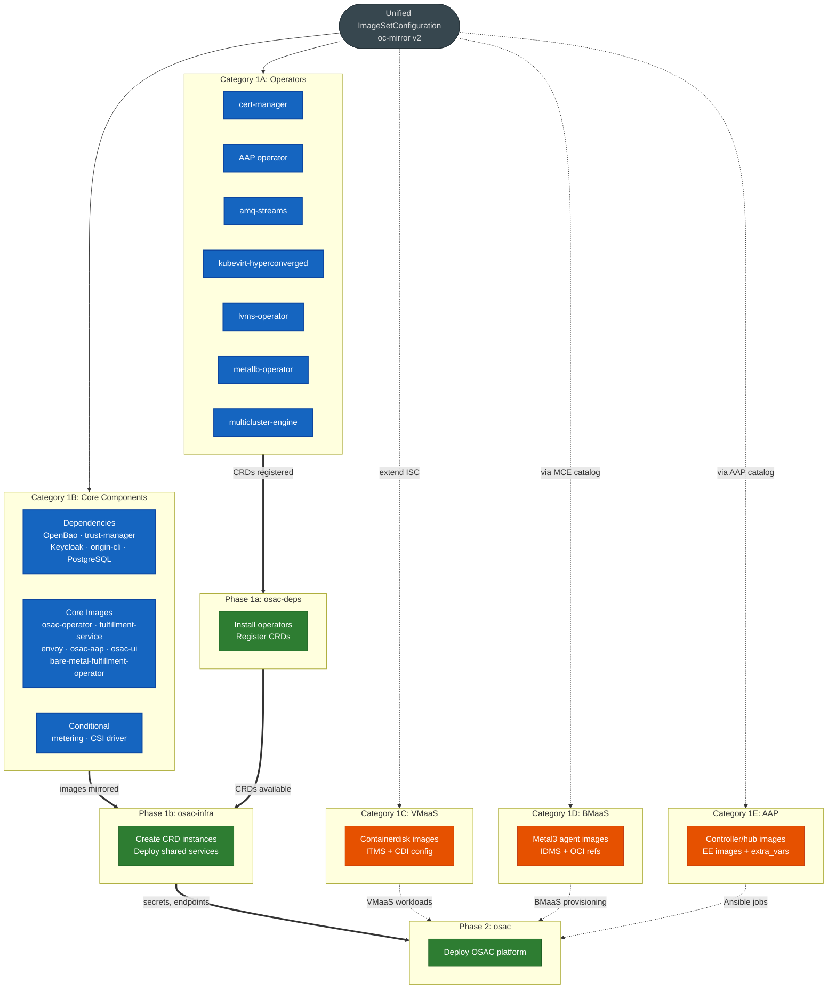

# Disconnected Mirroring Documentation

Category-specific guides for mirroring OSAC images and dependencies into
a disconnected (air-gapped) mirror registry.

## Overview

OSAC disconnected installation requires mirroring container images from
multiple upstream registries into a local mirror registry.  All mirroring
uses **`oc-mirror` v2** with an `ImageSetConfiguration` that defines
operators (via catalog mirroring) and additional images (via the
`additionalImages` section).

These category-specific guides break down the mirroring process into
focused, independently verifiable steps.  Each guide covers a specific
image group with its own prerequisites, execution steps, and BDD
verification scenarios.

> **Main guide**: For the unified end-to-end disconnected installation
> procedure, see [disconnected-install.md](../disconnected-install.md).

## Three-Phase Architecture

OSAC installation follows a strict three-phase deployment order:

| Phase | Helm Chart | Purpose | Mirroring Categories |
| ----- | ---------- | ------- | -------------------- |
| **Phase 1a** | `osac-deps` | Install OLM operators, register CRDs | [Category 1A](mirroring-operators.md) |
| **Phase 1b** | `osac-infra` | Create CRD instances, deploy shared services | [Category 1B](mirroring-core-components.md) |
| **Phase 2** | `osac` | Deploy the OSAC platform | [Category 1B](mirroring-core-components.md) |

Service-specific categories extend the base mirroring:

| Category | Service | Guide |
| -------- | ------- | ----- |
| **1C** | VMaaS (Virtual Machine as a Service) | [mirroring-vmaas.md](mirroring-vmaas.md) |
| **1D** | BMaaS (Bare Metal as a Service) | [mirroring-bmaas.md](mirroring-bmaas.md) |
| **1E** | AAP (Ansible Automation Platform) | [mirroring-aap.md](mirroring-aap.md) |

## Category Guides

### [Category 1A: Mirroring OLM Operators](mirroring-operators.md)

Mirror all **7 OLM-managed operators** required by OSAC:

1. `openshift-cert-manager-operator` — TLS certificate lifecycle
2. `ansible-automation-platform-operator` — AAP controller/hub
3. `amq-streams` — Kafka messaging
4. `kubevirt-hyperconverged` — VM workloads (VMaaS)
5. `lvms-operator` — Local volume provisioning
6. `metallb-operator` — Bare-metal load balancing
7. `multicluster-engine` — Cluster lifecycle and BMaaS agent services

### [Category 1B: Mirroring Core Components](mirroring-core-components.md)

Mirror OSAC dependency and core component images:

- **Dependencies** (6 images): OpenBao, trust-manager, Keycloak,
  origin-cli, PostgreSQL
- **Core components** (6 images): osac-operator, fulfillment-service,
  envoy, osac-aap, osac-ui, bare-metal-fulfillment-operator
- **Conditional metering** (3 images): metering-service, echo-adapter,
  m360-adapter
- **Conditional CSI** (4 images): osac-csi-driver + 3 CSI sidecars
- Bastion laptop workflow for Helm chart deployment
- Disconnected Helm values: `catalogSource`, `catalogSourceNamespace`,
  `cliImage`

### [Category 1C: Mirroring VMaaS Images](mirroring-vmaas.md)

Mirror VM disk images (containerdisks) for VMaaS:

- Containerdisk `additionalImages` entries
- ITMS configuration for tag-based image resolution
- CDI `pullMethod: node` workaround
- Known gap: OSAC-5188 (containerdisks not in Tier-1 mirror list)
- Known gap: OSAC-2991 (CDI pullMethod not in OSAC API)

### [Category 1D: Mirroring BMaaS Images](mirroring-bmaas.md)

Mirror BMaaS / Metal3 OCI images:

- Metal3 agent images via IDMS
- Post-OSAC-4558 OCI reference approach
- BareMetalHost provisioning verification

### [Category 1E: Mirroring AAP Images](mirroring-aap.md)

Mirror AAP controller/hub images:

- Operator-managed Redis and PostgreSQL (via `RELATED_IMAGE_*` env vars,
  not Helm values)
- Playbook `extra_vars` overrides for disconnected execution
- Execution environment image mirroring

## Dependency Flowchart

## Key Principles

1. **All images use `oc-mirror` v2** — No `skopeo copy` commands.  Every
   image is mirrored via the unified `ImageSetConfiguration` using either
   the `operators` section (for OLM catalogs) or the `additionalImages`
   section (for standalone images).

2. **No `global.imageRegistry`** — OSAC does not expose a global image
   registry override.  Disconnected image resolution relies on IDMS
   (ImageDigestMirrorSet) and ITMS (ImageTagMirrorSet) at the
   kubelet/CRI-O level.

3. **Three disconnected Helm values** — The only disconnected-specific
   Helm overrides are:
   - `catalogSource` — Name of the mirrored CatalogSource
   - `catalogSourceNamespace` — Namespace of the CatalogSource
   - `cliImage` — Mirrored origin-cli image reference

4. **Bastion laptop for Helm charts** — Helm charts cannot be mirrored
   by `oc-mirror` (RFE-8713, RFE-8748).  Use an internet-connected
   workstation to pull charts from `ghcr.io` and deploy via SSH tunnel.

5. **7 operators** — All seven operators must be mirrored, including
   `amq-streams` for Kafka messaging.

## Quick Reference

| What to mirror | How | Guide |
| -------------- | --- | ----- |
| OLM operator catalogs | `operators` section in ISC | [Category 1A](mirroring-operators.md) |
| Dependency images (OpenBao, Keycloak, etc.) | `additionalImages` in ISC | [Category 1B](mirroring-core-components.md) |
| OSAC core images | `additionalImages` in ISC | [Category 1B](mirroring-core-components.md) |
| Metering images (conditional) | `additionalImages` in ISC | [Category 1B](mirroring-core-components.md) |
| CSI driver images (conditional) | `additionalImages` in ISC | [Category 1B](mirroring-core-components.md) |
| VM containerdisks | `additionalImages` in ISC | [Category 1C](mirroring-vmaas.md) |
| Metal3 agent images | MCE operator catalog + `additionalImages` | [Category 1D](mirroring-bmaas.md) |
| AAP controller/hub images | AAP operator catalog (via RELATED_IMAGE) | [Category 1E](mirroring-aap.md) |
| Helm charts | Bastion laptop (NOT oc-mirror) | [Category 1B](mirroring-core-components.md) |
